# Trade

Flutter trading demo with a **mock live market feed**, watchlists, buy/sell ticket, and holdings with live P&amp;L.

Built with **light Clean Architecture + BLoC** — see [ARCHITECTURE.md](./ARCHITECTURE.md) for trade-offs (including what we deliberately skipped). Optional personal prep: [INTERVIEW_ANSWERS.md](./INTERVIEW_ANSWERS.md).

## Features

1. **Watchlist** — multiple lists, add/remove/reorder stocks, persist across restarts, tap to trade  
2. **Market** — live LTP for 10 NSE-style symbols with green/red flash; Normal / Stress tick rate  
3. **Buy/Sell ticket** — market orders at current LTP, wallet & holdings validation, confirmation  
4. **Holdings** — live P&amp;L, sortable, aggregate summary equals sum of rows, tap to trade  

## Screenshots

Screenshots are ordered by assignment feature. Images are cropped (status/nav chrome removed) and framed for the README.

### Feature 1 — Watchlist

<p align="center">
  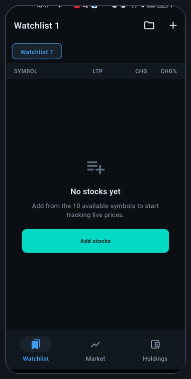
  &nbsp;
  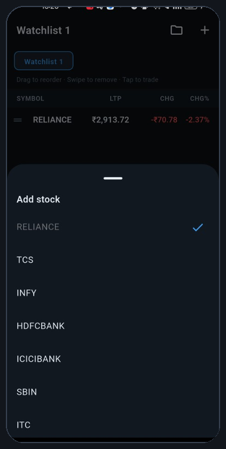
  &nbsp;
  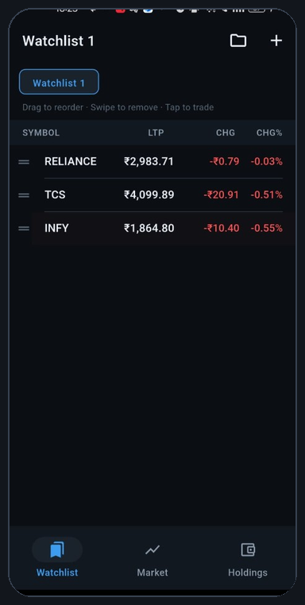
</p>

<p align="center"><sub>Empty state · Add from 10 symbols · Live LTP / CHG / CHG%</sub></p>

<p align="center">
  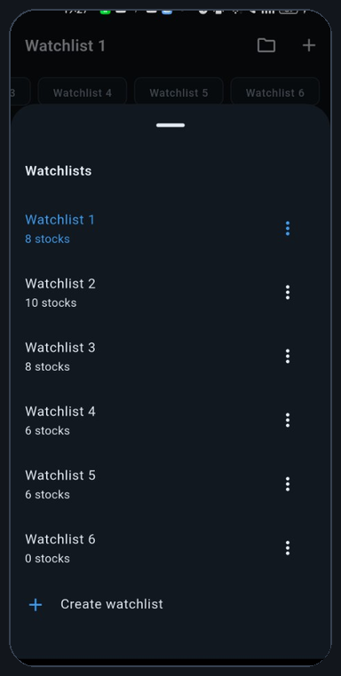
  &nbsp;
  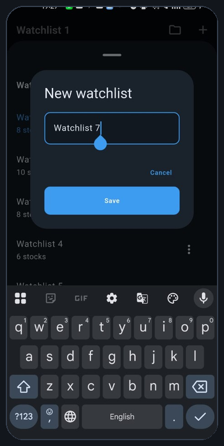
</p>

<p align="center"><sub>Multiple watchlists · Create / switch / rename / delete</sub></p>

### Feature 2 — Live Prices (Market)

<p align="center">
  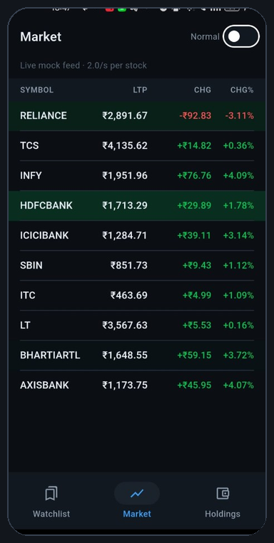
  &nbsp;
  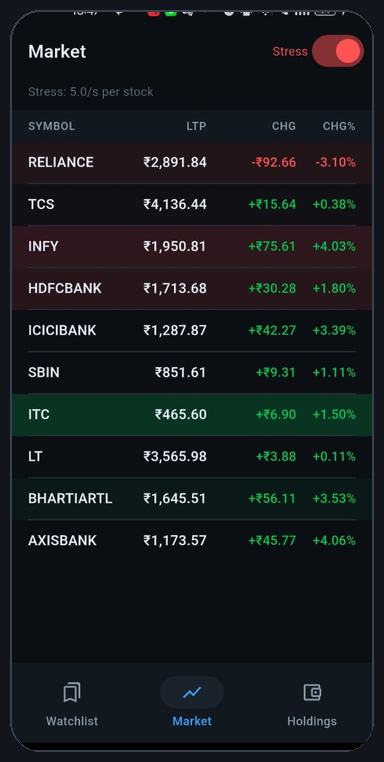
</p>

<p align="center"><sub>Normal (~2.0/s per stock) · Stress (~5.0/s per stock) with green/red flash on ticks</sub></p>

### Feature 3 — Buy / Sell Ticket

<p align="center">
  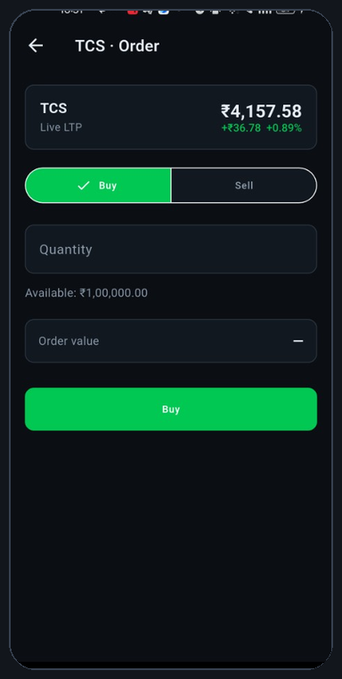
  &nbsp;
  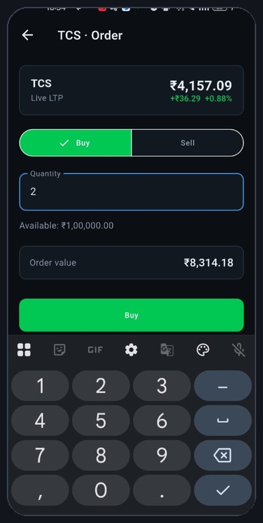
  &nbsp;
  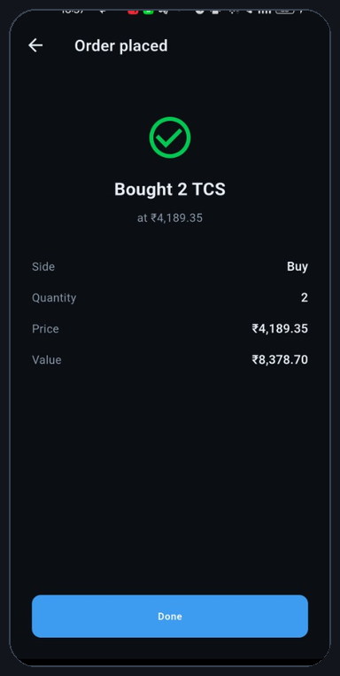
</p>

<p align="center"><sub>Buy · Live LTP + order value · Confirmation</sub></p>

<p align="center">
  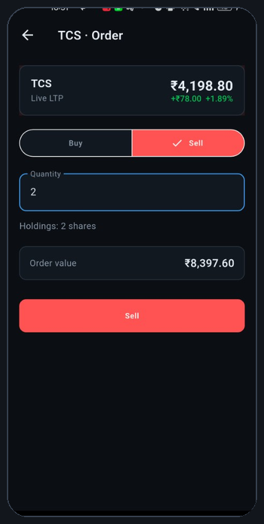
  &nbsp;
  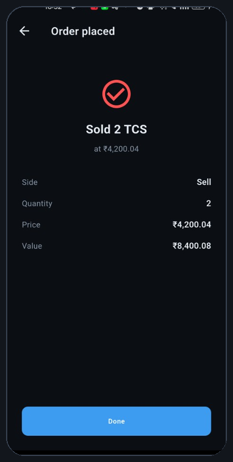
</p>

<p align="center"><sub>Sell · Confirmation after fill</sub></p>

<p align="center">
  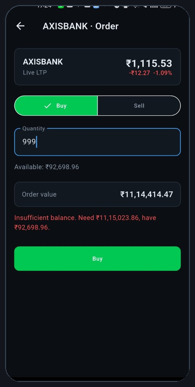
  &nbsp;
  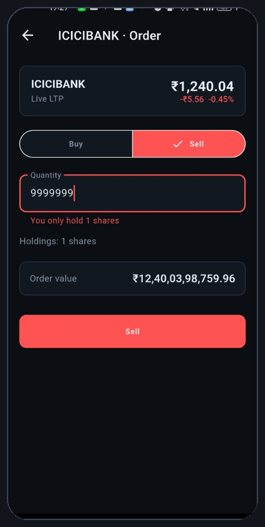
</p>

<p align="center"><sub>Insufficient balance blocked · Sell qty &gt; held blocked</sub></p>

### Feature 4 — Holdings

<p align="center">
  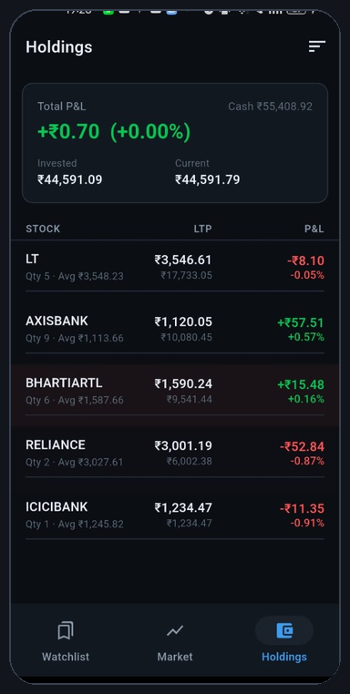
  &nbsp;
  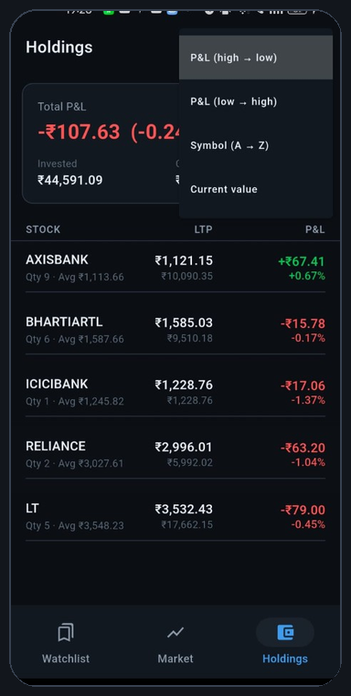
  &nbsp;
  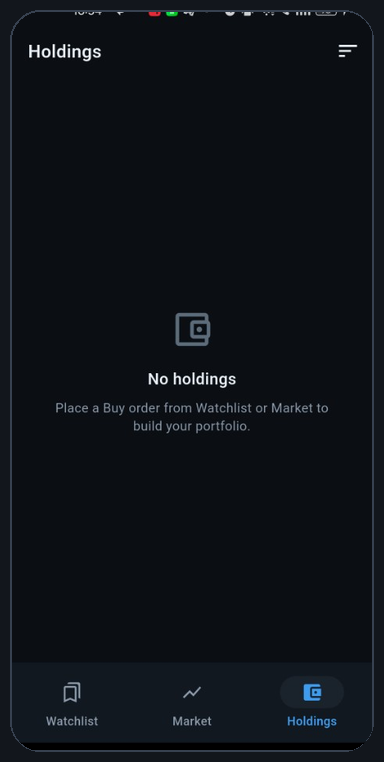
</p>

<p align="center"><sub>Live P&amp;L + cash · Sort by P&amp;L / symbol / value · Empty state</sub></p>

## Stack (minimal, defendable)

| Package | Why |
|---------|-----|
| `flutter_bloc` | Feature state + `BlocSelector` for per-symbol rebuilds |
| `equatable` | Cheap state/entity equality |
| `shared_preferences` | Persist watchlists / wallet / holdings / orders |
| `uuid` | Stable ids |
| `intl` | ₹ formatting only |

No `get_it`, `injectable`, `freezed`, or `go_router` — intentional for this size (explained in ARCHITECTURE.md).

## Stocks

`RELIANCE`, `TCS`, `INFY`, `HDFCBANK`, `ICICIBANK`, `SBIN`, `ITC`, `LT`, `BHARTIARTL`, `AXISBANK`

Starting cash: **₹1,00,000.00** · Money stored as **integer paise**

## Run

```bash
flutter pub get
flutter run
```

No backend, API keys, or extra setup.

### Unit tests (domain)

```bash
flutter test test/place_order_test.dart test/money_test.dart
```

> Note: if your project path contains an apostrophe (e.g. `Kasim'sStuff`), `flutter test` may fail due to a Flutter tooling path bug. Clone/copy the repo to a path without `'` to run tests, or run from CI.

### Suggested demo path (walkthrough video)

1. **Market** — live flashes; turn **Stress** on (~5 ticks/sec/stock); scroll — UI stays smooth  
2. **Watchlist** — create list, add stocks, **drag reorder**, swipe remove; force-quit & relaunch → restored  
3. Tap row → **Buy** → confirmation → **Holdings** live P&amp;L; change sort  
4. Ticket → sell more than held (error) → sell all → holding disappears; balance updated  

## Design decisions that match the brief

| Requirement risk | How we handled it |
|------------------|-------------------|
| Single price source | `MarketRepository` → one `MockMarketFeed` |
| Smooth under 50+ ticks/sec | Per-symbol `BlocSelector` + flash only on LTP change |
| Reorder without stale ticks | `ValueKey(symbol)` on rows |
| Exact money | `Money` paise ints; `PlaceOrderUseCase` unit-tested |
| Persist across restart | Repositories → SharedPreferences |
| Same stock in two watchlists | Both read the same `PricesCubit` map |

## Assignment checklist

- [x] Feature 1 Watchlist  
- [x] Feature 2 Live prices + configurable tick rate  
- [x] Feature 3 Buy/Sell ticket  
- [x] Feature 4 Holdings  
- [x] Persistence across restarts  
- [x] `flutter pub get && flutter run`  
- [x] Architecture documented with trade-offs  
- [x] Domain unit tests for money + orders  

Attach a short Loom/screen recording covering the demo path when submitting.
